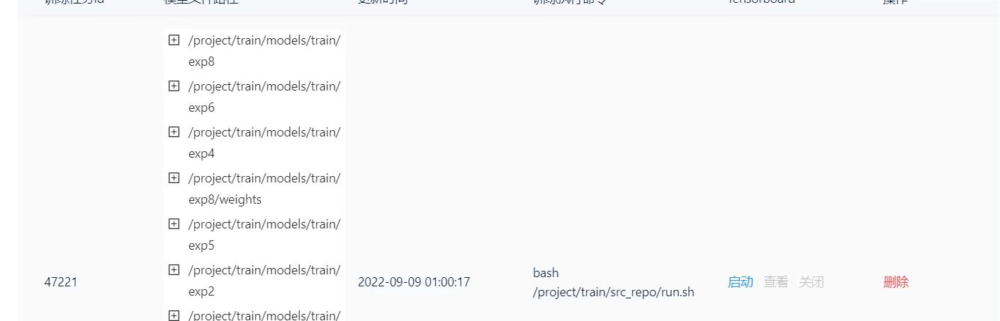
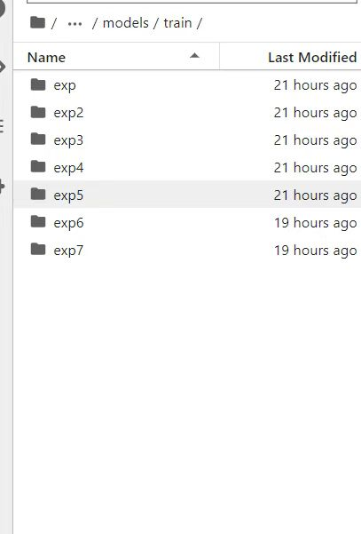
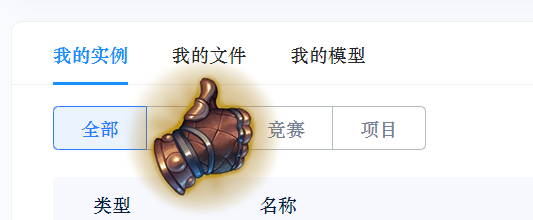

+ 我的训练任务完成之后，模型路径保存在/project/train/models/train/exp8中，但是我在终端里没有找到这个文件？

> 这是因为训练环境跟编码环境是独立的，训练环境的文件在编码环境是看不到的...但是发起测试可以看到.

+ pip失败！
> 🥰用清华源pip -i pip install -i https://pypi.tuna.tsinghua.edu.cn/simple

+ git失败！
> 建议先下载然后上传到我的文件，在获取链接😿

+ 如何查看训练过程中的loss图像？
> 可以用 tensorboard

+ 保存失败——超过模型最大1G限制
> 只保存best.pt跟last.pt就好了！不行的话重建环境试试吧☺️
